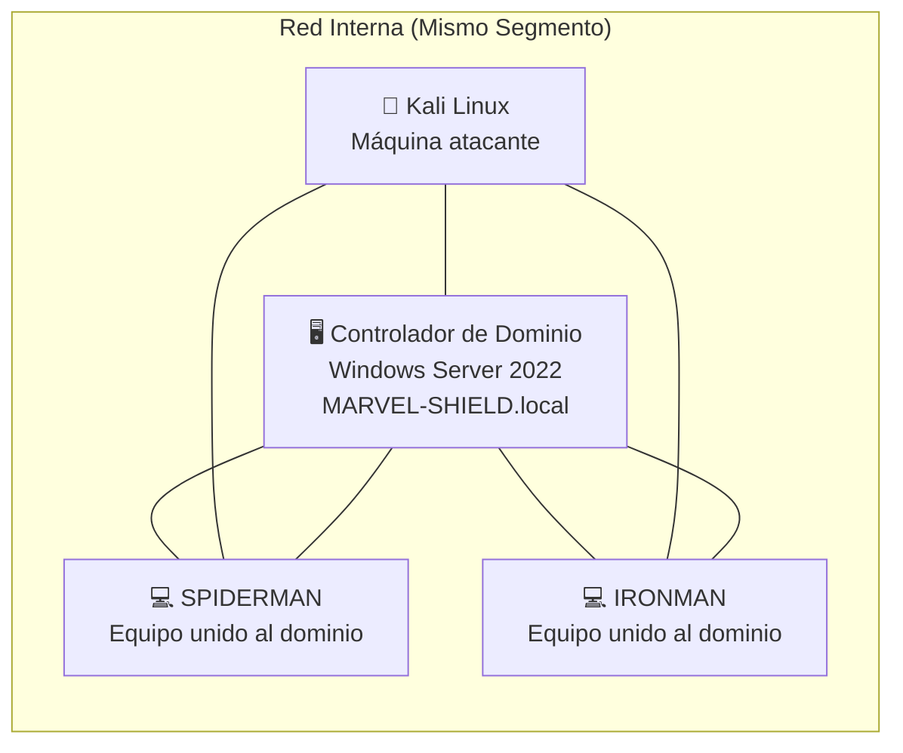
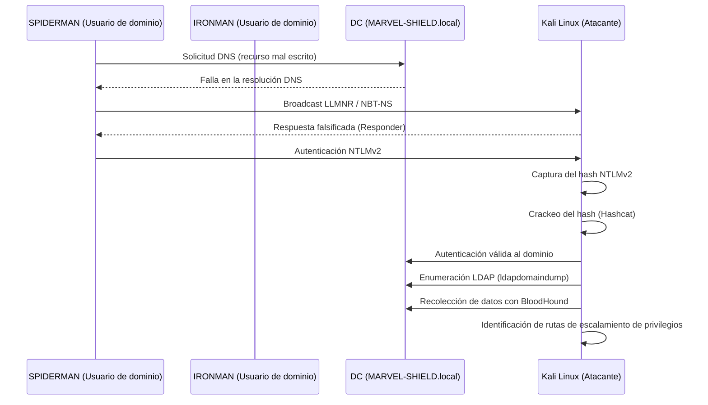
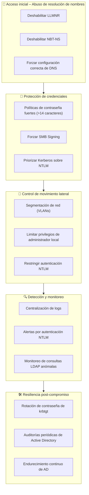

# Laboratorio de Pentesting Active Directory – MARVEL-SHIELD.local

> ⚠️ **Aviso importante**
> Este laboratorio fue ejecutado en un entorno **controlado** con fines **educativos y defensivos**. No se realizaron pruebas sobre sistemas productivos.

---

##  Descripción general

Este proyecto documenta un **laboratorio de pentesting en Active Directory** diseñado para simular un **escenario realista de ataque interno** en una red corporativa.

El objetivo principal **no es únicamente la explotación**, sino el **análisis del impacto post-compromiso, el riesgo operativo y las mitigaciones defensivas**, alineadas a buenas prácticas empresariales.

**Características del entorno:**

* **Dominio:** `MARVEL-SHIELD.local`
* **Controlador de Dominio (DC):** Windows Server 2022
* **Tipo de escenario:** Pentest interno (same network segment)

---

## 🧩 Topología del laboratorio

El entorno fue desplegado deliberadamente en el **mismo segmento de red**, reflejando una condición común en muchas organizaciones donde no existe una segmentación interna adecuada.

---

##  Flujo del ataque

El siguiente diagrama representa la **cadena completa del ataque**, desde el acceso inicial hasta la enumeración post-compromiso del dominio.

---

##  Herramientas y técnicas utilizadas

### Acceso inicial

* Envenenamiento LLMNR / NBT-NS
* Responder

### Ataques a credenciales

* Captura de hashes NTLMv2
* Ataques de diccionario con Hashcat

### Movimiento lateral y enumeración

* Autenticación SMB
* Enumeración LDAP (`ldapdomaindump`)
* Análisis de rutas de ataque con BloodHound

---

##  Estrategia de mitigación (Defense-in-Depth)

El siguiente diagrama mapea **controles defensivos** directamente contra cada fase del ataque identificado en el laboratorio.

---

##  Conclusiones clave

* Los compromisos de Active Directory **raramente dependen de CVEs**, sino de **mal diseño, configuraciones inseguras y confianza excesiva**.
* Obtener privilegios elevados **no es el objetivo final**; el valor real está en comprender el **impacto operativo y de negocio**.
* La seguridad efectiva en Active Directory requiere **controles en capas**, no soluciones aisladas.

---

##  Valor del laboratorio

Este proyecto demuestra:

* Simulación de escenarios realistas de ataque interno
* Capacidad de análisis post-compromiso
* Pensamiento ofensivo y defensivo combinado
* Habilidad para traducir hallazgos técnicos en **controles de seguridad**

---

##  Notas finales

Este laboratorio está orientado a:

* Aprendizaje en ciberseguridad
* Demostración de portafolio profesional
* Discusión técnica en entrevistas

No se afectaron sistemas productivos.
