# Active Directory Pentesting Lab – MARVEL-SHIELD.local

> ⚠️ **Disclaimer**
> This laboratory was executed in a **controlled environment** for **educational and defensive security purposes only**. No production systems were affected.

---

##  Overview

This project documents an **Active Directory pentesting laboratory** designed to simulate a **realistic internal attack scenario** within a corporate network.

The primary goal is **not only exploitation**, but the **analysis of post-compromise impact, operational risk, and defensive mitigations**, aligned with enterprise security best practices.

**Environment characteristics:**

* **Domain:** `MARVEL-SHIELD.local`
* **Domain Controller (DC):** Windows Server 2022
* **Scenario type:** Internal pentest (same network segment)

---

## 🧩 Lab Topology

The environment was deliberately deployed within the **same network segment**, reflecting a common real-world condition where internal network segmentation is absent or insufficient.

```mermaid
flowchart LR
    subgraph Network["Internal Network (Same Segment)"]
        DC["🖥️ Domain Controller\nWindows Server 2022\nMARVEL-SHIELD.local"]
        SP["💻 SPIDERMAN\nDomain-Joined Workstation"]
        IR["💻 IRONMAN\nDomain-Joined Workstation"]
        KALI["🐉 Kali Linux\nAttacker Machine"]
    end

    DC --- SP
    DC --- IR
    SP --- DC
    IR --- DC

    KALI --- DC
    KALI --- SP
    KALI --- IR
```

---

##  Attack Flow

The following diagram represents the **complete attack chain**, from initial access to post-compromise domain enumeration.

---

## 🛠️ Tools & Techniques

### Initial Access

* LLMNR / NBT-NS poisoning
* Responder

### Credential Attacks

* NTLMv2 hash capture
* Dictionary attacks with Hashcat

### Lateral Movement & Enumeration

* SMB authentication
* LDAP enumeration (`ldapdomaindump`)
* Attack path analysis using BloodHound

---

##  Mitigation Strategy (Defense-in-Depth)

The following diagram maps **defensive controls** directly to each phase of the identified attack chain.

```mermaid
flowchart TB
    subgraph Phase1["🧪 Initial Access – Name Resolution Abuse"]
        LLMNR["Disable LLMNR"]
        NBTNS["Disable NBT-NS"]
        DNS["Enforce proper DNS configuration"]
    end

    subgraph Phase2["🔑 Credential Protection"]
        PASS["Strong password policies (>14 characters)"]
        SMB_SIGN["Enforce SMB Signing"]
        KERB["Prefer Kerberos over NTLM"]
    end

    subgraph Phase3["🚧 Lateral Movement Control"]
        SEG["Network segmentation (VLANs)"]
        ADMIN["Limit local administrator privileges"]
        NTLM["Restrict NTLM authentication"]
    end

    subgraph Phase4["🔍 Detection & Monitoring"]
        LOG["Centralized logging"]
        AUTH["Alerts on NTLM authentication"]
        LDAP["Monitor abnormal LDAP queries"]
    end

    subgraph Phase5["🛠️ Post-Compromise Resilience"]
        ROTATE["Rotate krbtgt account password"]
        AUDIT["Regular Active Directory security audits"]
        HARD["Continuous AD hardening"]
    end

    Phase1 --> Phase2
    Phase2 --> Phase3
    Phase3 --> Phase4
    Phase4 --> Phase5
```

---

##  Key Takeaways

* Active Directory compromises **rarely rely on CVEs**, but instead on **poor design, insecure configurations, and excessive trust**.
* Achieving elevated privileges **is not the final objective**; the real value lies in understanding **business and operational impact**.
* Effective AD security requires **layered controls**, not single-point solutions.

---

##  Lab Value

This project demonstrates:

* Realistic internal attack simulation
* Post-compromise analysis capabilities
* Combined offensive and defensive security thinking
* Ability to translate technical findings into **security controls**

---

##  Final Notes

This laboratory is intended for:

* Cybersecurity learning
* Professional portfolio demonstration
* Technical interview discussion

No production systems were impacted.
